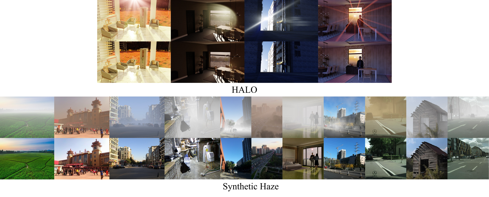

# UniSER-Datasets 🌫️✨

[](https://arxiv.org/abs/2511.14183)
[](https://huggingface.co/datasets/jdzhang0929/uniser-haze-dataset)
[](https://huggingface.co/datasets/jdzhang0929/halo-flare-dataset)
[](LICENSE)

Companion **dataset releases** for our CVPR 2026 paper, *UniSER: A Foundation Model for Unified Soft Effects Removal* — covering large-scale synthetic haze and 3D-rendered lens flare.

<p align="center">
  
</p>

## 📦 What's in the release

Two datasets ship to Hugging Face. Both are sharded in [WebDataset](https://github.com/webdataset/webdataset) format with `~2 GB` shards for fast streaming and partial-download support.

| Dataset | 🤗 Repo | Samples | Total size | Format |
|---|---|---:|---:|---|
| **Synthetic Haze** | [`jdzhang0929/uniser-haze-dataset`](https://huggingface.co/datasets/jdzhang0929/uniser-haze-dataset) | ~80.9k clean GTs / ~2M haze variants | ~2.5 TB | 1,327 WebDataset shards |
| **HALO Lens Flare** | [`jdzhang0929/halo-flare-dataset`](https://huggingface.co/datasets/jdzhang0929/halo-flare-dataset) | 4,945 triplets (light / flare / separate) | ~153 GB | 71 WebDataset shards |

Both releases are **gated** (auto-approval) under **CC-BY-NC-SA-4.0** for non-commercial academic research. Click through on each HF page to accept the terms.

---

## 🌫️ Synthetic Haze Dataset

Six upstream image sources augmented with a physically-motivated atmospheric rendering on Marigold-predicted depth — covering homogeneous, non-homogeneous, indoor, outdoor, daytime, and dense haze.

| Source | Unique GTs | Haze variants / image | GT shipped? |
|---|---:|---:|:---:|
| HAZESPACE2M | 66,133 | 24 | ✅ |
| RESIDE-ITS | 11,000 | 19 | ✅ |
| RESIDE-OTS | 2,061 | 37 | ❌ ([fetcher](scripts/prepare_ots_originals.py)) |
| WSRD | 1,000 | 24 | ✅ |
| Flare-R | 600 | 24 | ✅ |
| ISTD | 135 | 24 | ✅ |
| **Total** | **~80.9k** | varied | — |

**Per-sample layout** inside a haze shard:
```
<source>/<base_name>.gt.<ext>           clean GT (absent for OTS)
<source>/<base_name>.haze_NNN.png       synthesized haze variant
<source>/<base_name>.haze_NNN.txt       descriptive tag (e.g. out_fog_120)
<source>/<base_name>.json               per-sample metadata
```

> **Note**: RESIDE-OTS clean images are not bundled because they carry third-party photographer copyrights. After downloading, run [`scripts/prepare_ots_originals.py`](scripts/prepare_ots_originals.py) to fetch them from the official RESIDE source.

---

## ✨ HALO Synthetic Lens-Flare Dataset

3D-rendered lens-flare dataset: 4,945 4K-resolution samples spanning **32 scenes** × **4 flare types**, each sample shipping as a clean / flared / flare-only triplet. Suitable for paired flare-removal training as well as additive decomposition (`flare = light + separate`).

| Effect type | Count | Description |
|---|---:|---|
| **Streak** | 1,656 | bright streak / anamorphic stretch flares |
| **Reflective** | 1,655 | inter-element ghost reflections |
| **Glare** | 817 | wide soft halo + bloom |
| **Shimmer** | 817 | iridescent / dispersive flare |
| **Total** | **4,945** | |

**Per-sample layout** inside a HALO shard:
```
halo/<base_name>.gt.png         clean scene without flare         (RGBA, 3840×2160)
halo/<base_name>.flare.png      same scene with flare added       (RGBA, 3840×2160)
halo/<base_name>.separate.png   flare-only on transparent bg      (RGBA, 3840×2160)
halo/<base_name>.json           per-sample metadata
```

`base_name` encodes `{scene}_{effect_id}_{camera}` (e.g. `Scene003_Glare001_camera01`).

See [`docs/halo_structure.md`](docs/halo_structure.md) for the full schema and per-scene distribution.

---

## 🚀 Quick Start

### Setup

```bash
pip install -U "huggingface_hub[hf_xet]" webdataset pillow
hf auth login
# Then visit and accept the terms at each dataset's HF page:
#   https://huggingface.co/datasets/jdzhang0929/uniser-haze-dataset
#   https://huggingface.co/datasets/jdzhang0929/halo-flare-dataset
```

### Load the Synthetic Haze dataset

```python
import io, json, random
from huggingface_hub import HfFileSystem
import webdataset as wds
from PIL import Image

REPO = "jdzhang0929/uniser-haze-dataset"
urls = [
    f"https://huggingface.co/datasets/{REPO}/resolve/main/{p[len(f'datasets/{REPO}/'):]}"
    for p in HfFileSystem().ls(f"datasets/{REPO}/shards", detail=False)
    if p.endswith(".tar")
]

def decode(s):
    if "json" not in s:
        return None
    meta = json.loads(s["json"])
    haze_keys = sorted(k for k in s if k.startswith("haze_") and k.endswith(".png"))
    if not haze_keys:
        return None
    chosen = random.choice(haze_keys)
    gt_key = next((k for k in s if k.startswith("gt.")), None)
    return {
        "source":    meta["source"],
        "base_name": meta["base_name"],
        "gt":        Image.open(io.BytesIO(s[gt_key])).convert("RGB") if gt_key else None,
        "haze":      Image.open(io.BytesIO(s[chosen])).convert("RGB"),
        "tag":       s[chosen.replace(".png", ".txt")].decode(),
    }

pipeline = (wds.WebDataset(urls, shardshuffle=True)
              .shuffle(1000)
              .map(decode)
              .select(lambda x: x is not None))

for sample in pipeline:
    print(sample["source"], sample["base_name"], sample["tag"])
    break
```

A full example with a preview-grid renderer is in [`examples/load_dataset.py`](examples/load_dataset.py).

### Load the HALO Lens-Flare dataset

```python
import io, json
from huggingface_hub import HfFileSystem
import webdataset as wds
from PIL import Image

REPO = "jdzhang0929/halo-flare-dataset"
urls = [
    f"https://huggingface.co/datasets/{REPO}/resolve/main/{p[len(f'datasets/{REPO}/'):]}"
    for p in HfFileSystem().ls(f"datasets/{REPO}/shards", detail=False)
    if p.endswith(".tar")
]

def decode(s):
    if "json" not in s:
        return None
    meta = json.loads(s["json"])
    return {
        "sample_id": meta["sample_id"],
        "scene":     meta["scene"],
        "effect":    meta["effect_id"],
        "light":     Image.open(io.BytesIO(s["gt.png"])).convert("RGB"),
        "flare":     Image.open(io.BytesIO(s["flare.png"])).convert("RGB"),
        "separate":  Image.open(io.BytesIO(s["separate.png"])),  # keep RGBA
    }

pipeline = (wds.WebDataset(urls, shardshuffle=True)
              .shuffle(500)
              .map(decode)
              .select(lambda x: x is not None))

for sample in pipeline:
    print(sample["sample_id"], sample["scene"], sample["effect"])
    break
```

### Render quick preview galleries

```bash
# Synthetic Haze — 60 samples mixed across sources
python scripts/make_haze_gallery.py --total 60 --out-dir /tmp/haze_preview

# HALO — triplet view with light / flare / separate side-by-side
python scripts/make_halo_gallery.py --total 60 --out-dir /tmp/halo_preview

python3 -m http.server --directory /tmp/haze_preview 8000   # then 8001 for halo
```

---

## 📁 Repository layout

```
.
├── README.md                     ← you are here
├── assets/                       teaser + vis_dataset graphics
├── docs/
│   ├── dataset_structure.md      haze shard layout + sample fields
│   ├── halo_structure.md         HALO shard layout + per-scene table
│   └── upstream_licenses.md      per-haze-source license details
├── examples/
│   └── load_dataset.py           end-to-end haze loader example
└── scripts/
    ├── make_haze_gallery.py      stream haze shards from HF and render preview
    ├── make_halo_gallery.py      stream HALO shards from HF and render triplet preview
    └── prepare_ots_originals.py  fetch RESIDE-OTS clean images (not redistributed)
```

---

## 📜 License

- **Code** in this repository: [MIT](LICENSE).
- **Bundled haze dataset** on Hugging Face: CC-BY-NC-SA-4.0 (inherited from the strictest upstream — WSRD).
- **HALO dataset** on Hugging Face: CC-BY-NC-SA-4.0; HDRI environments retain their upstream licenses (Poly Haven CC0; freepoly.org terms).
- **Each haze subset** retains its own upstream license — redistribution and use must comply with each. See [`docs/upstream_licenses.md`](docs/upstream_licenses.md).

---

## 📝 Roadmap

- ✅ *Nov 17, 2025*: Release arXiv preprint.
- ✅ *May 27, 2026*: Release synthetic haze dataset on Hugging Face.
- ✅ *Jun 13, 2026*: Release HALO 3D-rendered lens flare dataset on Hugging Face.

---

## 📚 Citation

If you find these datasets useful, please cite UniSER:

```bibtex
@article{zhang2025uniser,
  title={UniSER: A Foundation Model for Unified Soft Effects Removal},
  author={Zhang, Jingdong and Zhang, Lingzhi and Liu, Qing and Chiu, Mang Tik and Barnes, Connelly and Wang, Yizhou and You, Haoran and Liu, Xiaoyang and Zhou, Yuqian and Lin, Zhe and others},
  journal={arXiv preprint arXiv:2511.14183},
  year={2025}
}
```

<details>
<summary><b>Upstream subset citations</b> (click to expand — please also cite every subset you use)</summary>

```bibtex
@inproceedings{islam2024hazespace2m,
  title={Hazespace2m: A dataset for haze aware single image dehazing},
  author={Islam, Md Tanvir and Rahim, Nasir and Anwar, Saeed and Saqib, Muhammad and Bakshi, Sambit and Muhammad, Khan},
  booktitle={Proceedings of the 32nd ACM International Conference on Multimedia},
  pages={9155--9164},
  year={2024}
}

@inproceedings{ancuti2018ihaze,
  title={I-HAZE: A dehazing benchmark with real hazy and haze-free indoor images},
  author={Ancuti, Cosmin and Ancuti, Codruta O and Timofte, Radu and De Vleeschouwer, Christophe},
  booktitle={International conference on advanced concepts for intelligent vision systems},
  pages={620--631},
  year={2018},
  organization={Springer}
}

@inproceedings{ancuti2018ohaze,
  title={O-haze: a dehazing benchmark with real hazy and haze-free outdoor images},
  author={Ancuti, Codruta O and Ancuti, Cosmin and Timofte, Radu and De Vleeschouwer, Christophe},
  booktitle={Proceedings of the IEEE conference on computer vision and pattern recognition workshops},
  pages={754--762},
  year={2018}
}

@inproceedings{ancuti2019dense,
  title={Dense-haze: A benchmark for image dehazing with dense-haze and haze-free images},
  author={Ancuti, Codruta O and Ancuti, Cosmin and Sbert, Mateu and Timofte, Radu},
  booktitle={2019 IEEE international conference on image processing (ICIP)},
  pages={1014--1018},
  year={2019},
  organization={IEEE}
}

@inproceedings{ancuti2020nh,
  title={NH-HAZE: An image dehazing benchmark with non-homogeneous hazy and haze-free images},
  author={Ancuti, Codruta O and Ancuti, Cosmin and Timofte, Radu},
  booktitle={Proceedings of the IEEE/CVF conference on computer vision and pattern recognition workshops},
  pages={444--445},
  year={2020}
}

@inproceedings{ancuti2021ntire,
  title={NTIRE 2021 nonhomogeneous dehazing challenge report},
  author={Ancuti, Codruta O and Ancuti, Cosmin and Vasluianu, Florin-Alexandru and Timofte, Radu},
  booktitle={Proceedings of the IEEE/CVF Conference on Computer Vision and Pattern Recognition},
  pages={627--646},
  year={2021}
}

@inproceedings{ancuti2023ntire,
  title={Ntire 2023 hr nonhomogeneous dehazing challenge report},
  author={Ancuti, Codruta O and Ancuti, Cosmin and Vasluianu, Florin-Alexandru and Timofte, Radu and Zhou, Han and Dong, Wei and Liu, Yangyi and Chen, Jun and Liu, Huan and Li, Liangyan and others},
  booktitle={Proceedings of the IEEE/CVF Conference on Computer Vision and Pattern Recognition},
  pages={1808--1825},
  year={2023}
}

@inproceedings{ancuti2024ntire,
  title={NTIRE 2024 dense and non-homogeneous dehazing challenge report},
  author={Ancuti, Codruta O and Ancuti, Cosmin and Vasluianu, Florin-Alexandru and Timofte, Radu and Liu, Yidi and Wang, Xingbo and Zhu, Yurui and Shi, Gege and Lu, Xin and Fu, Xueyang and others},
  booktitle={Proceedings of the IEEE/CVF Conference on Computer Vision and Pattern Recognition},
  pages={6453--6468},
  year={2024}
}

@article{li2018benchmarking,
  title={Benchmarking single-image dehazing and beyond},
  author={Li, Boyi and Ren, Wenqi and Fu, Dengpan and Tao, Dacheng and Feng, Dan and Zeng, Wenjun and Wang, Zhangyang},
  journal={IEEE transactions on image processing},
  volume={28},
  number={1},
  pages={492--505},
  year={2018},
  publisher={IEEE}
}

@inproceedings{zhang2024lmhaze,
  title={Lmhaze: intensity-aware image dehazing with a large-scale multi-intensity real haze dataset},
  author={Zhang, Ruikun and Yang, Hao and Yang, Yan and Fu, Ying and Pan, Liyuan},
  booktitle={Proceedings of the 6th ACM International Conference on Multimedia in Asia},
  pages={1--1},
  year={2024}
}

@article{dai2024mipi,
  title={MIPI 2024 Challenge on Nighttime Flare Removal: Methods and Results},
  author={Dai, Yuekun and Zhang, Dafeng and Li, Xiaoming and Yue, Zongsheng and Li, Chongyi and Zhou, Shangchen and Feng, Ruicheng and others},
  journal={arXiv preprint arXiv:2404.19534},
  year={2024}
}

@inproceedings{wang2018stacked,
  title={Stacked conditional generative adversarial networks for jointly learning shadow detection and shadow removal},
  author={Wang, Jifeng and Li, Xiang and Yang, Jian},
  booktitle={Proceedings of the IEEE conference on computer vision and pattern recognition},
  pages={1788--1797},
  year={2018}
}

@inproceedings{vasluianu2023wsrd,
  title={Wsrd: A novel benchmark for high resolution image shadow removal},
  author={Vasluianu, Florin-Alexandru and Seizinger, Tim and Timofte, Radu},
  booktitle={Proceedings of the IEEE/CVF Conference on Computer Vision and Pattern Recognition},
  pages={1826--1835},
  year={2023}
}
```

</details>

The full list also lives in [`CITATION.bib`](CITATION.bib) for convenience.

If you find this repository helpful, please consider ⭐ starring the project!

## 📮 Contact

Please contact [Jingdong Zhang](https://evergreen0929.github.io/) with any questions.
