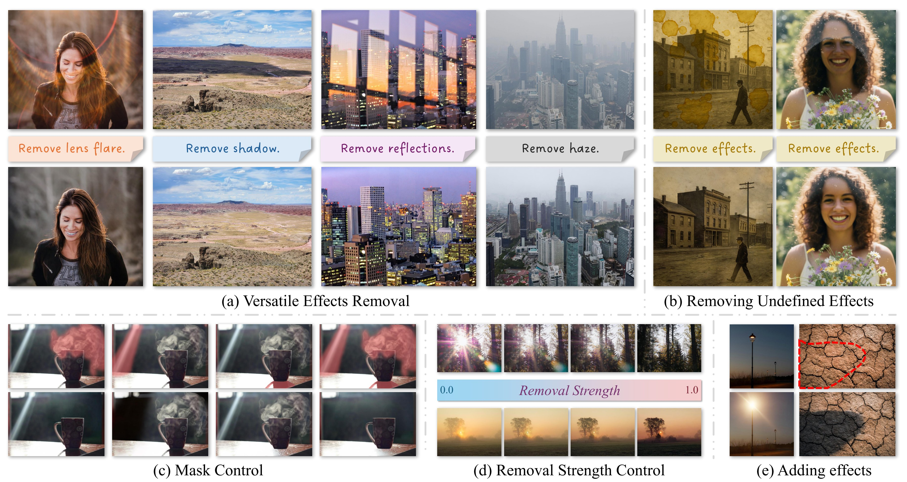

# UniSER: A Foundation Model for Unified Soft Effects Removal 🌫️ [ *CVPR 2026* ]

[](https://arxiv.org/abs/2511.14183)
[](https://huggingface.co/datasets/jdzhang0929/uniser-haze-dataset)
[](LICENSE)

<p align="center">
  
</p>

## 📜 Introduction

This repository releases the **synthetic haze dataset** from our CVPR 2026 paper, *UniSER: A Foundation Model for Unified Soft Effects Removal*. The dataset bundles ~80k unique clean images with ~2 million physically-motivated haze / fog / smoke renderings — covering homogeneous, non-homogeneous, indoor, outdoor, daytime, and dense atmospheric conditions — for training and benchmarking single-image dehazing.

> Jingdong Zhang, Lingzhi Zhang, Qing Liu, Mang Tik Chiu, Connelly Barnes, Yizhou Wang, Haoran You, Xiaoyang Liu, Yuqian Zhou, Zhe Lin, Eli Shechtman, Sohrab Amirghodsi, Xin Li, Wenping Wang, Xiaohang Zhan
>
> CVPR 2026

🤗 **[`jdzhang0929/uniser-haze-dataset`](https://huggingface.co/datasets/jdzhang0929/uniser-haze-dataset)** — full release on Hugging Face (~2.5 TB, gated).

## 📦 Dataset Composition

Six upstream sources, augmented with a physically-motivated atmospheric rendering on Marigold-predicted depth. HALO_QING (3D-rendered flare scenes) is excluded from the public release.

| Source | Unique GTs | Haze variants / image | GT shipped? |
|---|---:|---:|:---:|
| HAZESPACE2M | 66,133 | 24 | ✅ |
| RESIDE-ITS | 11,000 | 19 | ✅ |
| RESIDE-OTS | 2,061 | 37 | ❌ ([fetcher](scripts/prepare_ots_originals.py)) |
| WSRD | 1,000 | 24 | ✅ |
| Flare-R | 600 | 24 | ✅ |
| ISTD | 135 | 24 | ✅ |
| **Total** | **~80.9k** | varied | — |

<p align="center">
  
</p>

## 🚀 Quick Start

### Setup

```bash
pip install -U "huggingface_hub[hf_xet]" webdataset pillow
hf auth login
# Then visit and accept the terms at:
#   https://huggingface.co/datasets/jdzhang0929/uniser-haze-dataset
```

### Load the dataset

The dataset is sharded in WebDataset format. Each sample carries a clean GT (except OTS), one or more haze variants, descriptive tags, and metadata.

```python
import io, json, random
from huggingface_hub import HfFileSystem
import webdataset as wds
from PIL import Image

REPO = "jdzhang0929/uniser-haze-dataset"
urls = [
    f"https://huggingface.co/datasets/{REPO}/resolve/main/{p[len(f'datasets/{REPO}/'):]}"
    for p in HfFileSystem().ls(f"datasets/{REPO}/shards", detail=False)
    if p.endswith(".tar")
]

def decode(s):
    if "json" not in s:
        return None
    meta = json.loads(s["json"])
    haze_keys = sorted(k for k in s if k.startswith("haze_") and k.endswith(".png"))
    if not haze_keys:
        return None
    chosen = random.choice(haze_keys)
    gt_key = next((k for k in s if k.startswith("gt.")), None)
    return {
        "source":    meta["source"],
        "base_name": meta["base_name"],
        "gt":        Image.open(io.BytesIO(s[gt_key])).convert("RGB") if gt_key else None,
        "haze":      Image.open(io.BytesIO(s[chosen])).convert("RGB"),
        "tag":       s[chosen.replace(".png", ".txt")].decode(),
    }

pipeline = (wds.WebDataset(urls, shardshuffle=True)
              .shuffle(1000)
              .map(decode)
              .select(lambda x: x is not None))

for sample in pipeline:
    print(sample["source"], sample["base_name"], sample["tag"])
    break
```

A full example with a preview-grid renderer is at [`examples/load_dataset.py`](examples/load_dataset.py).

### Render a quick preview gallery

```bash
python scripts/make_haze_gallery.py --total 60 --out-dir /tmp/preview
python3 -m http.server --directory /tmp/preview 8000
```

## ⚠️ Caveats

**RESIDE-OTS clean images are not bundled** because the originals carry third-party photographer copyrights. After downloading the dataset, run [`scripts/prepare_ots_originals.py`](scripts/prepare_ots_originals.py) to fetch them from the official RESIDE source and align them locally by `base_name`.

## 📝 TODO

- ✅ *Nov 17, 2025*: Release arXiv preprint.
- ✅ *May 27, 2026*: Release synthetic haze dataset on Hugging Face.
- [ ] Release HALO (3D-rendered lens flare dataset).
- [ ] Release LR-SRD (Large Real-world Shadow Removal Dataset).

## 🛠️ Reproducing the synthesis

You only need this if you want to **rebuild the dataset** with different source images or rendering parameters — most users should just download from Hugging Face. The synthesis pipeline is in [`scripts/`](scripts/); detailed docs:

- [`docs/depth_generation.md`](docs/depth_generation.md) — Marigold setup and depth inference (`scripts/run_marigold_depth.py`)
- [`docs/dataset_structure.md`](docs/dataset_structure.md) — shard layout and sample fields
- [`docs/upstream_licenses.md`](docs/upstream_licenses.md) — per-source license details

The core renderer ([`scripts/synthesize_haze.py`](scripts/synthesize_haze.py)) implements the physically-motivated atmospheric model from §7 of the paper:

$$I_\text{out} = I_\text{in} \cdot T + A \cdot \omega_0 \kappa \cdot (1 - T^\eta), \quad T = e^{-\tau}$$

with optional Perlin-noise modulation of optical thickness $\tau$ for non-uniform haze and valley fog.

## 📜 License

- **Code** in this repository: [MIT](LICENSE).
- **Bundled dataset** on Hugging Face: CC-BY-NC-SA-4.0 (inherited from the strictest upstream).
- **Each subset** retains its upstream license; redistribution and use must comply with each.

## 📚 Citation

If you find this dataset useful, please cite UniSER:

```bibtex
@article{zhang2025uniser,
  title={UniSER: A Foundation Model for Unified Soft Effects Removal},
  author={Zhang, Jingdong and Zhang, Lingzhi and Liu, Qing and Chiu, Mang Tik and Barnes, Connelly and Wang, Yizhou and You, Haoran and Liu, Xiaoyang and Zhou, Yuqian and Lin, Zhe and others},
  journal={arXiv preprint arXiv:2511.14183},
  year={2025}
}
```

<details>
<summary><b>Upstream subset citations</b> (click to expand — please also cite every subset you use)</summary>

```bibtex
@inproceedings{islam2024hazespace2m,
  title={Hazespace2m: A dataset for haze aware single image dehazing},
  author={Islam, Md Tanvir and Rahim, Nasir and Anwar, Saeed and Saqib, Muhammad and Bakshi, Sambit and Muhammad, Khan},
  booktitle={Proceedings of the 32nd ACM International Conference on Multimedia},
  pages={9155--9164},
  year={2024}
}

@inproceedings{ancuti2018ihaze,
  title={I-HAZE: A dehazing benchmark with real hazy and haze-free indoor images},
  author={Ancuti, Cosmin and Ancuti, Codruta O and Timofte, Radu and De Vleeschouwer, Christophe},
  booktitle={International conference on advanced concepts for intelligent vision systems},
  pages={620--631},
  year={2018},
  organization={Springer}
}

@inproceedings{ancuti2018ohaze,
  title={O-haze: a dehazing benchmark with real hazy and haze-free outdoor images},
  author={Ancuti, Codruta O and Ancuti, Cosmin and Timofte, Radu and De Vleeschouwer, Christophe},
  booktitle={Proceedings of the IEEE conference on computer vision and pattern recognition workshops},
  pages={754--762},
  year={2018}
}

@inproceedings{ancuti2019dense,
  title={Dense-haze: A benchmark for image dehazing with dense-haze and haze-free images},
  author={Ancuti, Codruta O and Ancuti, Cosmin and Sbert, Mateu and Timofte, Radu},
  booktitle={2019 IEEE international conference on image processing (ICIP)},
  pages={1014--1018},
  year={2019},
  organization={IEEE}
}

@inproceedings{ancuti2020nh,
  title={NH-HAZE: An image dehazing benchmark with non-homogeneous hazy and haze-free images},
  author={Ancuti, Codruta O and Ancuti, Cosmin and Timofte, Radu},
  booktitle={Proceedings of the IEEE/CVF conference on computer vision and pattern recognition workshops},
  pages={444--445},
  year={2020}
}

@inproceedings{ancuti2021ntire,
  title={NTIRE 2021 nonhomogeneous dehazing challenge report},
  author={Ancuti, Codruta O and Ancuti, Cosmin and Vasluianu, Florin-Alexandru and Timofte, Radu},
  booktitle={Proceedings of the IEEE/CVF Conference on Computer Vision and Pattern Recognition},
  pages={627--646},
  year={2021}
}

@inproceedings{ancuti2023ntire,
  title={Ntire 2023 hr nonhomogeneous dehazing challenge report},
  author={Ancuti, Codruta O and Ancuti, Cosmin and Vasluianu, Florin-Alexandru and Timofte, Radu and Zhou, Han and Dong, Wei and Liu, Yangyi and Chen, Jun and Liu, Huan and Li, Liangyan and others},
  booktitle={Proceedings of the IEEE/CVF Conference on Computer Vision and Pattern Recognition},
  pages={1808--1825},
  year={2023}
}

@inproceedings{ancuti2024ntire,
  title={NTIRE 2024 dense and non-homogeneous dehazing challenge report},
  author={Ancuti, Codruta O and Ancuti, Cosmin and Vasluianu, Florin-Alexandru and Timofte, Radu and Liu, Yidi and Wang, Xingbo and Zhu, Yurui and Shi, Gege and Lu, Xin and Fu, Xueyang and others},
  booktitle={Proceedings of the IEEE/CVF Conference on Computer Vision and Pattern Recognition},
  pages={6453--6468},
  year={2024}
}

@article{li2018benchmarking,
  title={Benchmarking single-image dehazing and beyond},
  author={Li, Boyi and Ren, Wenqi and Fu, Dengpan and Tao, Dacheng and Feng, Dan and Zeng, Wenjun and Wang, Zhangyang},
  journal={IEEE transactions on image processing},
  volume={28},
  number={1},
  pages={492--505},
  year={2018},
  publisher={IEEE}
}

@inproceedings{zhang2024lmhaze,
  title={Lmhaze: intensity-aware image dehazing with a large-scale multi-intensity real haze dataset},
  author={Zhang, Ruikun and Yang, Hao and Yang, Yan and Fu, Ying and Pan, Liyuan},
  booktitle={Proceedings of the 6th ACM International Conference on Multimedia in Asia},
  pages={1--1},
  year={2024}
}

@article{dai2024mipi,
  title={MIPI 2024 Challenge on Nighttime Flare Removal: Methods and Results},
  author={Dai, Yuekun and Zhang, Dafeng and Li, Xiaoming and Yue, Zongsheng and Li, Chongyi and Zhou, Shangchen and Feng, Ruicheng and others},
  journal={arXiv preprint arXiv:2404.19534},
  year={2024}
}

@inproceedings{wang2018stacked,
  title={Stacked conditional generative adversarial networks for jointly learning shadow detection and shadow removal},
  author={Wang, Jifeng and Li, Xiang and Yang, Jian},
  booktitle={Proceedings of the IEEE conference on computer vision and pattern recognition},
  pages={1788--1797},
  year={2018}
}

@inproceedings{vasluianu2023wsrd,
  title={Wsrd: A novel benchmark for high resolution image shadow removal},
  author={Vasluianu, Florin-Alexandru and Seizinger, Tim and Timofte, Radu},
  booktitle={Proceedings of the IEEE/CVF Conference on Computer Vision and Pattern Recognition},
  pages={1826--1835},
  year={2023}
}
```

</details>

The full list also lives in [`CITATION.bib`](CITATION.bib) for convenience.

If you find this repository helpful, please consider ⭐ starring the project!

## 📮 Contact

Please contact [Jingdong Zhang](https://evergreen0929.github.io/) with any questions.
